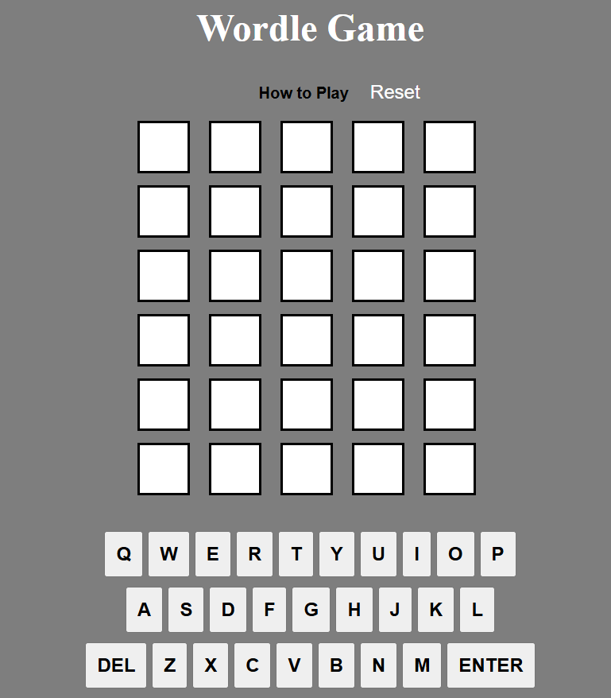

# wordle-Game

## **Introduction**

a game where you have just six tries to uncover a hidden five-letter word — that’s Wordle. Simple in design, yet strangely addictive. I decided to recreate it not just because I enjoy playing it during quiet moments, but because I’ve always been intrigued by what makes it tick beneath the surface. Ahead, I’ll break down the logic behind the game and how it all comes together.

## **Technologies Used**

* HTML5
* CSS3
* JavaScript
* Git

## **Win and Lose**

 function checkGuess() {
        let guessString = currentGuess.join('');

        

        if (guessString.length !== 5) {
            showNotification("Not enough letters!");
            return;
        }

        if (!WORDS.includes(guessString.toLowerCase())) { 
            showNotification("Word not in list!");
            return;
        }

        // Process the guess and update box colors
        let rightGuess = Array.from(rightGuessString);
        for (let i = 0; i < 5; i++) {
            let letterColor = '';
            let box = document.querySelectorAll('.wordle > div')[(guessNumber - guessesRemaining) * 5 + i];
            let letter = currentGuess[i];

            let letterPosition = rightGuess.indexOf(letter.toLowerCase()); // Convert to lowercase for comparison
            if (letterPosition === -1) {
                letterColor = 'grey'; 
            } else {
                if (letter.toLowerCase() === rightGuess[i].toLowerCase()) {
                    letterColor = 'green'; 
                } else {
                    letterColor = 'yellow'; 
                }
                rightGuess[letterPosition] = "#"; 
            }

            // Apply color with a slight delay for animation effect
            let delay = 250 * i;
            setTimeout(() => {
                box.style.backgroundColor = letterColor;
                shadeKeyBoard(letter, letterColor);
            }, delay);
        }

        // Check for win/loss conditions
        if (guessString.toLowerCase() === rightGuessString.toLowerCase()) {
            showNotification("You guessed right!");
            guessesRemaining = 0; // End game
        } else {
            guessesRemaining -= 1;
            currentGuess = [];
            nextLetter = 0;

            if (guessesRemaining === 0) {
                showNotification(`You've run out of guesses! The word was: "${rightGuessString}"`);
            }
        }
    }

**The Game**

https://devalimadan.github.io/wordle-Game.
    
## **Next Step**

* Improve the CSS

* Import an online word list

## **Conclusion**

I Enjoied building Thins Game, Even if i did stuggle a little, It made me thing about the How and what, which is what i got stuck on (How should i start and with What first); In the end i really did enjoy building it 

